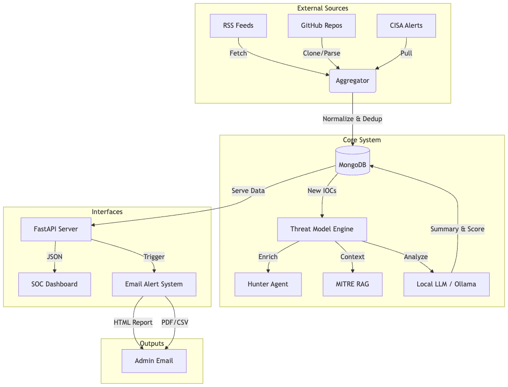

# AI-Powered Threat Intelligence Platform

A Threat Intelligence Platform that aggregates, correlates, and analyzes threat data using Local LLMs (Ollama), RAG, and autonomous Hunter Agents.


---

## Key Capabilities

- **Scalable Aggregation**: Collects IOCs from 100+ sources including RSS feeds, GitHub repos, CISA alerts, Cisco Talos, Kaspersky, and more.
- **Cognitive Analysis**: Uses Local LLMs (Qwen2.5/LLaMA3) for automated verification and human-readable threat summaries.
- **Knowledge Graph Intelligence**: Maps relationships between threats using a high-fidelity star topology with real-time graph visualization.
- **Autonomous Hunter**: Enriches IOCs with Geolocation, WHOIS, ASN, and DNS resolution.
- **RAG Integration**: Maps threats to MITRE ATT&CK techniques using semantic search.
- **Smart Alerting**: Batches high-severity threats into HTML email reports with PDF and CSV attachments.
- **Interactive SOC Dashboard**: Real-time 2D force-directed graph with physics manipulation, connectivity filtering, and live threat feed monitoring.

---

## Architecture



The platform is composed of four main microservices:

1.  **[Threat Intel Aggregator](./threat_intel_aggregator)**: The ingestion engine. Fetches, normalizes, and deduplicates IOCs.
2.  **[Threat Model](./threat_model)**: The brain. Uses LLMs and RAG to analyze threats and component for email alerts.
3.  **[Unified API Server](./unified_api_server.py)**: The gateway. Exposes data via REST API (FastAPI) with rate limiting.
4.  **[SOC Dashboard](./soc-dashboard)**: The frontend. A Next.js interface for analysts.

---

## Quick Start

### Option A: Docker (Recommended)

Run the entire stack with a single command:

```bash
# Start all services (API, Mongo, Scheduler, Dashboard)
make docker-up

# Access Dashboard: http://localhost:3000
# Access API Docs: http://localhost:8000/docs
```

### Option B: Manual Setup

**1. Prerequisites**

- Python 3.11+
- Node.js 18+
- MongoDB running locally
- Ollama running (`ollama serve`)

**2. Backend Setup**

```bash
# Install dependencies
make install

# Start API Server
make run-api

# Start Scheduler (in new terminal)
make run-scheduler
```

**3. Frontend Setup**

```bash
cd soc-dashboard
npm install
npm run dev
```

---

## Configuration

Create a `.env` file in the root directory:

```env
# Database
MONGO_URI=mongodb://localhost:27017/
MONGO_DB=threat_intel

# AI Engine
OLLAMA_URL=http://localhost:11434
OLLAMA_MODEL=qwen2.5:7b

# Email Alerts
EMAIL_HOST=smtp.gmail.com
EMAIL_PORT=587
EMAIL_USER=your-email@gmail.com
EMAIL_PASS=your-app-password
EMAIL_TO=admin@example.com
EMAIL_USE_TLS=true

# System
LOG_LEVEL=INFO
SCHEDULER_INTERVAL=10
```

To configure feeds, edit `threat_intel_aggregator/feed_collection/feeds.yaml`.

---

## Email Alerts

The system includes a robust email alerting module located in `threat_model/threat_summarizer/emailer.py`.

- **Triggers**:
  - High/Critical severity threats detected by the AI.
  - Batch processing (every 10 minutes or 10 high-severity items).
- **Content**:
  - **HTML Body**: Summary of threats, severity counts, and MITRE TTPs.
  - **Attachments**:
    - `threat_summary_report.pdf`: Detailed investigation report.
    - `threat_summaries.csv`: Raw data for import.

---

## API Reference

| Method | Endpoint                | Description                             |
| :----- | :---------------------- | :-------------------------------------- |
| `GET`  | `/api/iocs`             | List enriched IOCs with filters.        |
| `POST` | `/api/summarize`        | Generate AI summary for a specific IOC. |
| `GET`  | `/api/feeds`            | Get feed health status.                 |
| `POST` | `/api/reports/generate` | Create PDF reports.                     |
| `POST` | `/api/email/send`       | Trigger manual email report.            |

---

## Project Structure

```
ai-threat-intel/
├── unified_api_server.py        # Main API Gateway
├── threat_intel_aggregator/     # Ingestion Module
│   ├── main.py                  # Scheduler
│   └── feed_collection/         # Fetchers & Parsers
├── threat_model/                # AI Analysis Module
│   ├── hunter.py                # Enrichment Agent
│   └── threat_summarizer/       # LLM & RAG Logic
│       └── emailer.py           # Email Alert System
├── soc-dashboard/               # Frontend UI (Next.js)
├── docker-compose.yml           # Container Orchestration
└── Makefile                     # Automation Scripts
```

---

## Contributors

- **Saara Unnathi R** — Feed Collection · IOC Parsing
- **N Ragavenderan** — AI Architecture · API · Dashboard
