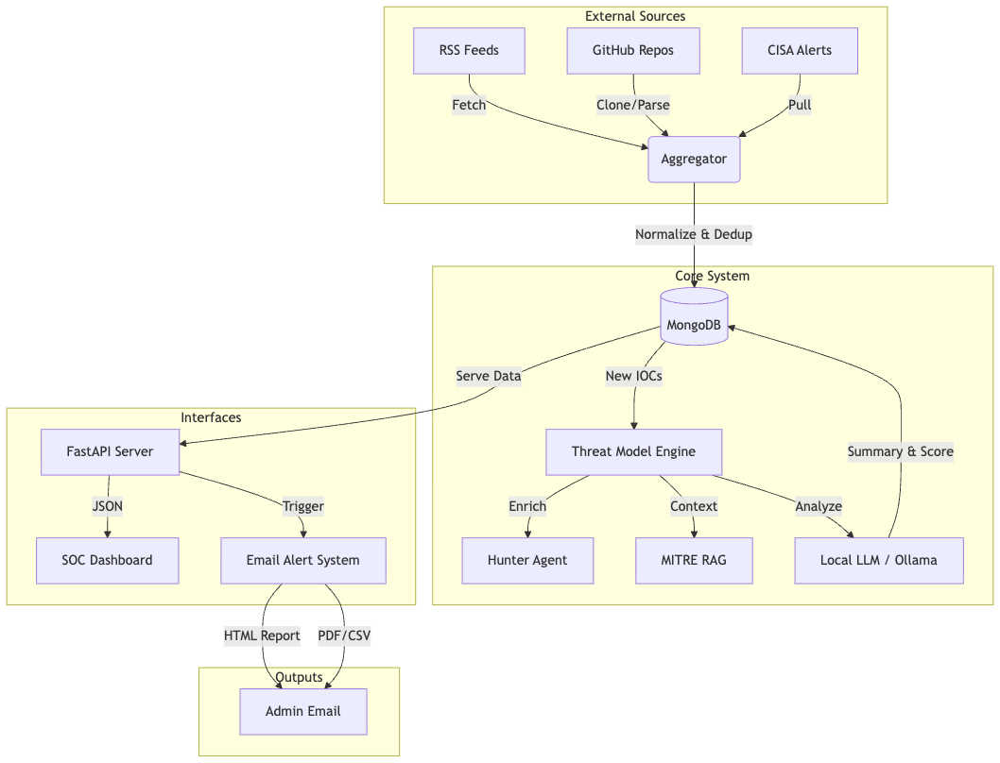

# AI-Powered Threat Intelligence Platform

A threat intelligence platform that aggregates indicators of compromise (IOCs)
from open sources, verifies and summarizes them with local LLMs, links them
into a knowledge graph, groups them into campaigns, and serves the results
through a REST API and a SOC dashboard. The LLM stages run locally through
Ollama, so report data does not need to leave the host.


---

## What it does

- **Feed aggregation** — collects IOCs from 102 configured sources (RSS/Atom
  feeds, auto-discovered GitHub security repositories, and JSON/CSV/text
  endpoints), normalizes them to a common schema, and deduplicates by
  `type::value` SHA-256.
- **LLM verification and summarization** — a local Ollama model filters regex
  candidates and writes human-readable threat summaries with a severity score.
- **MITRE ATT&CK mapping** — retrieval-augmented lookup maps observed behavior
  to ATT&CK techniques with confidence scores.
- **IOC enrichment** — the Hunter agent adds geolocation, WHOIS, ASN, and DNS
  data for IPs and domains.
- **Knowledge graph** — relates indicators, campaigns, and techniques and
  exposes the graph for querying and visualization.
- **Campaign detection** — groups related indicators into campaigns using
  community detection on the knowledge graph, with temporal and severity
  metadata.
- **Predictive GraphRAG** — a multi-step LLM pipeline that uses the knowledge
  graph to forecast an attacker's likely next ATT&CK techniques.
- **Alerting** — batches high- and critical-severity threats into HTML email
  reports with PDF and CSV attachments.
- **SOC dashboard** — a Next.js interface with a force-directed graph view and
  live feed monitoring.

---

## Architecture



The platform has four parts:

1. **[`threat_intel_aggregator/`](./threat_intel_aggregator)** — ingestion and
   analytics. Feed collection, IOC extraction, the knowledge graph, campaign
   detection, predictive GraphRAG, and the evaluation harness.
2. **[`threat_model/`](./threat_model)** — analysis. The Hunter enrichment
   agent, the LLM + RAG summarizer, and the email/report generators.
3. **[`unified_api_server.py`](./unified_api_server.py)** — a FastAPI gateway
   exposing IOCs, feeds, summaries, the knowledge graph, campaigns,
   predictions, and evaluation runs.
4. **[`soc-dashboard/`](./soc-dashboard)** — the Next.js analyst frontend.

MongoDB is the shared store; Ollama serves the local LLMs.

---

## Repository layout

```
ai-threat-intel/
├── unified_api_server.py        # FastAPI gateway
├── final_scheduler.py           # Periodic collection + analysis scheduler
├── run_evaluation.py            # Research/evaluation entry point
├── Makefile                     # install / run / docker / lint targets
├── docker-compose.yml           # API, MongoDB, scheduler, dashboard
├── threat_intel_aggregator/     # Ingestion and analytics (see its README)
│   ├── feed_collection/         # Fetchers, parsers, IOC extraction
│   ├── knowledge_graph/         # Graph construction and queries
│   ├── campaign_detector/       # Temporal clustering into campaigns
│   ├── predictive_graphrag/     # TTP prediction over the graph
│   └── evaluation/              # Calibration, conformal, adversarial studies
├── threat_model/                # Enrichment + LLM analysis (see its README)
├── soc-dashboard/               # Next.js frontend
├── scripts/                     # Reproducibility harness for the evaluation
└── RESULTS.md                   # Recorded evaluation results
```

---

## Quick start

### Option A — Docker

```bash
make docker-up        # API, MongoDB, scheduler, dashboard
# Dashboard: http://localhost:3000
# API docs:  http://localhost:8000/docs
make docker-down      # stop
```

### Option B — manual

**Prerequisites:** Python 3.11+, Node.js 18+, MongoDB, and Ollama (`ollama serve`).

```bash
# Backend
make install          # install Python dependencies
make run-api          # start the FastAPI server
make run-scheduler    # start the collection scheduler (separate terminal)

# Frontend
cd soc-dashboard && npm install && npm run dev
```

---

## Configuration

Create a `.env` file in the repository root:

```env
# Database
MONGO_URI=mongodb://localhost:27017/
MONGO_DB=threat_intel

# Local LLMs (Ollama)
OLLAMA_URL=http://localhost:11434
OLLAMA_MODEL=qwen2.5:7b          # summarizer
IOC_VERIFIER_MODEL=qwen3.5:9b    # IOC verifier

# Email alerts
EMAIL_HOST=smtp.gmail.com
EMAIL_PORT=587
EMAIL_USER=your-email@gmail.com
EMAIL_PASS=your-app-password
EMAIL_TO=admin@example.com
EMAIL_USE_TLS=true

# System
LOG_LEVEL=INFO
SCHEDULER_INTERVAL=10            # minutes
```

Feed sources are defined in
`threat_intel_aggregator/feed_collection/feeds.yaml`.

---

## API reference

The gateway exposes roughly thirty endpoints; the full, interactive list is at
`/docs`. The main groups:

| Group           | Examples                                                                 |
| :-------------- | :----------------------------------------------------------------------- |
| IOCs            | `GET /api/iocs`, `GET /api/iocs/stats`, `POST /api/iocs/verify`          |
| Feeds           | `GET /api/feeds`, `GET /api/feeds/stats`, `POST /api/feeds/collect`      |
| Summaries       | `POST /api/summarize`, `GET /api/summaries`                              |
| Reports & email | `POST /api/reports/generate`, `POST /api/email/send`                     |
| Knowledge graph | `GET /api/knowledge-graph`, `GET /api/knowledge-graph/query`             |
| Campaigns       | `GET /api/campaigns`, `GET /api/campaigns/timeline`                      |
| Prediction      | `POST /api/predict/campaign/{id}`, `GET /api/predict/history/{id}`       |
| Evaluation      | `POST /api/evaluation/run`, `GET /api/evaluation/results`                |

---

## Research and evaluation

The IOC extraction pipeline is evaluated under graded text obfuscation, with
post-hoc confidence calibration, a distribution-free conformal auto-apply
guarantee, and an adversarial threat model. The study code lives in
`threat_intel_aggregator/evaluation/`, the reproducibility harness in
`scripts/`, and recorded numbers in [`RESULTS.md`](./RESULTS.md).

```bash
python run_evaluation.py        # run the evaluation suite
```

---

## Contributors

- **Saara Unnathi R** — feed collection, IOC parsing
- **N. Ragavenderan** — pipeline architecture, API, dashboard, evaluation
