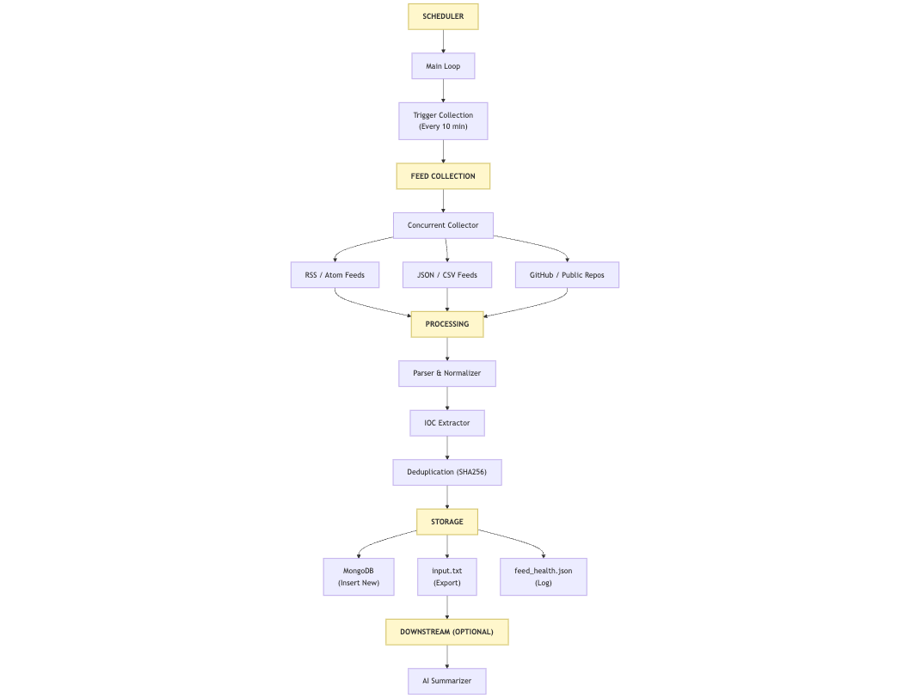

# Threat Intelligence Feed Aggregator

A fully automated, production-grade threat intelligence feed aggregator that collects, normalizes, and deduplicates Indicators of Compromise (IOCs) from various open sources.

## Key Features

*   **Multi-Source Collection**:
    *   **RSS/Atom Feeds**: Standard threat feed consumption.
    *   **GitHub Discovery**: Automatically discovers and consumes Atom feeds from security repositories (e.g., `theZoo`, `atomic-red-team`).
    *   **JSON/CSV/Text**: Flexible parsing for unstructured or semi-structured data.
*   **Intelligent Processing**:
    *   **Concurrent Fetching**: Uses thread pools for high-speed parallel data collection.
    *   **Smart Normalization**: Standardizes IOCs into common formats (IP, Domain, URL, Hash, CVE).
    *   **Deduplication**: Uses SHA256 hashing (`type::value`) to prevent duplicate entries in the database.
*   **Robust Architecture**:
    *   **Fault Tolerance**: Automatic retries with exponential backoff for network failures.
    *   **Health Monitoring**: Tracks feed uptime, response times, and success rates.
    *   **Alerting**: Email alerts triggered after 3 consecutive failures, including uptime stats and CSV reports.
*   **Integration Ready**:
    *   Exports to MongoDB for persistent storage.
    *   Generates `input.txt` for downstream AI summarization (e.g., Ollama/LLM pipelines).

---

## Architecture



The system follows a standard ETL (Extract, Transform, Load) pipeline:

1.  **Scheduler**: Triggers collection every 10 minutes (configurable).
2.  **Collector**: Fetches data from configured sources in parallel.
3.  **Parser/Extractor**: Identifies IOCs using regex and normalizes them.
4.  **Writer**:
    *   **MongoDB**: Stores structured, deduplicated IOCs.
    *   **Filesystem**: export `input.txt` for external tools.

---

## Project Structure

```plaintext
threat_intel_aggregator/
├── main.py                  # Entry point & Scheduler
├── feed_collection/
│   ├── collector.py         # Concurrent fetcher & retry logic
│   ├── github_discovery.py  # GitHub feed auto-discovery
│   ├── parser.py            # Data normalization & cleanup
│   ├── ioc_extractor.py     # Regex-backed IOC extraction
│   ├── mongo_writer.py      # Database interaction & Deduplication
│   ├── config.py            # Configuration loader
│   ├── feeds.yaml           # STATIC Feed definitions
│   └── health.py            # Health tracking logic
├── data/                    # Local data storage
│   ├── normalized_iocs.json # Latest processed IOCs
│   ├── normalized_iocs.csv  # CSV export for reports
│   ├── feed_health.json     # Feed status tracking
│   ├── feed_collector.log   # Application logs
│   └── raw_feeds.json       # Intermediate raw data
├── enums.py                 # IOC Types & Severity definitions
└── requirements.txt         # Dependencies
```

---

## Installation & Setup

### 1. Prerequisites

*   Python 3.8+
*   MongoDB (Local or Atlas)

### 2. Install Dependencies

```bash
cd threat_intel_aggregator
pip install -r requirements.txt
```

### 3. Configuration

#### Feeds (`feed_collection/feeds.yaml`)
Define your static feed sources here. The aggregator also auto-discovers GitHub feeds.

```yaml
feeds:
  - name: "Hybrid Analysis"
    url: "https://www.hybrid-analysis.com/feed?json"
    source_type: "json"
    category: "general"
  
  - name: "CISA US-CERT"
    url: "https://www.us-cert.gov/ncas/alerts.xml"
    source_type: "rss"
    category: "government"
```

#### Environment Variables
Create a `.env` file for sensitive config (optional, defaults provided):

```env
MONGO_URI=mongodb://localhost:27017/
MONGO_DB=threat_intel
MONGO_IOC_COLLECTION=iocs
```

*(Note: Email alerts are currently configured in `main.py`. Update credentials there if needed.)*

---

## Usage

Start the aggregator:

```bash
python main.py
```

*   **First Run**: Runs immediately upon startup.
*   **Loop**: Runs every 10 minutes thereafter.
*   **Logs**: storage in `data/feed_collector.log`.

### Stopping
Press `Ctrl+C` to gracefully stop the scheduler.

---

## Output Files

| File | Description |
| :--- | :--- |
| **`data/normalized_iocs.json`** | JSON list of all extracted IOCs from the last run. |
| **`data/normalized_iocs.csv`** | CSV version of the IOCs, used for email attachments. |
| **`../threat_model/input.txt`** | Simplified bullet-list of IOCs for AI Summarizers. |
| **`data/feed_health.json`** | Tracks last success/failure and response time for each feed. |

---

## Monitoring & Alerts

The system includes a built-in "Dead Man's Switch":
*   **Trigger**: If the collection job fails 3 times in a row.
*   **Action**: Sends an email to the configured administrator.
*   **Content**: Includes failure reason, system uptime, and a CSV report of the last known IOCs.
