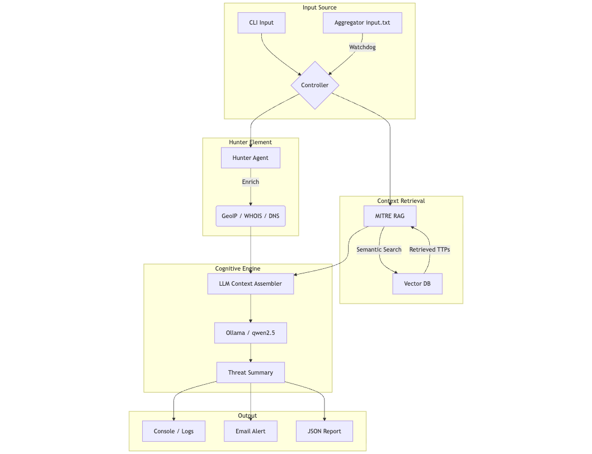

# AI Threat Summarizer & Hunter Agent

A cognitive threat analysis engine that combines Local LLMs (Ollama) with a dedicated "Hunter" agent to enrich, analyze, and summarize threat indicators.

## Key Features

*   **Local LLM Intelligence**:
    *   Powered by **Ollama** (Default: `qwen2.5:7b`).
    *   Offline-first privacy and low latency.
*   **Hunter Agent**:
    *   Automatically detects IOCs (IPs, Domains).
    *   Performs real-time enrichment (Geolocation, WHOIS, DNS resolution).
*   **RAG Integration**:
    *   Retrieves relevant **MITRE ATT&CK** techniques.
    *   Maps observed behaviors to TTPs using semantic search.
*   **Automated TTP Mapping**:
    *   Extracts Tactics, Techniques, and Procedures from unstructured data.
    *   Assigns confidence scores to each mapping.
*   **Dual Operation Modes**:
    *   **CLI**: Interactive manual analysis.
    *   **Watchdog**: Automated pipeline monitoring `input.txt` from the aggregator.

---

## Architecture



1.  **Input**: Receives IOCs from the CLI or the Aggregator (`input.txt`).
2.  **Hunter**: Enriches the IOC with network data (GeoIP, ASN, WHOIS).
3.  **RAG**: Queries the MITRE ATT&CK knowledge base for context.
4.  **LLM**: Synthesizes the enrichment + RAG context + prompt templates.
5.  **Output**: Generates a structured summary, severity score, and TTP map.

---

## Project Structure

```plaintext
threat_model/
├── main.py                     # Interactive CLI entry point
├── hunter.py                   # Hunter Agent (Enrichment)
├── threat_summarizer/
│   ├── summarizer.py           # Core LLM & RAG logic
│   ├── watch_and_run.py        # Automated Watchdog loop
│   ├── mitre_rag.py            # MITRE Knowledge Base retrieval
│   ├── model_client.py         # Ollama API client
│   ├── prompt_template.txt     # Jinja2 prompt templates
│   └── ttp_template.txt        # TTP extraction prompts
├── logs/                       # Execution logs
└── requirements.txt            # Dependencies
```

---

## Setup & Configuration

### 1. Prerequisites

*   **Ollama** installed and running.
*   Pull the default model:
    ```bash
    ollama pull qwen2.5:7b
    ```

### 2. Install Dependencies

```bash
cd threat_model
pip install -r requirements.txt
```

---

## Usage

### Interactive CLI (Manual Analysis)
Run the manual analysis tool to query specific IOCs or threat descriptions.

```bash
python main.py
```
*   **Input**: `192.168.1.5` or "Phishing email with malicious attachment".
*   **Output**: Real-time summary on console.

### Automated Watchdog (Pipeline Mode)
Monitors the `input.txt` file (populated by `threat_intel_aggregator`) and processes new IOCs automatically.

```bash
python -m threat_summarizer.watch_and_run
```

*   **Monitors**: `../threat_model/input.txt`
*   **Action**: Summarizes new lines as they appear.
*   **Alerts**: Sends batch emails for High/Critical threats.

---

## Output Examples

The module produces structured JSON output used for reporting:

```json
{
  "timestamp": "2024-02-08T10:00:00+05:30",
  "input": "103.15.5.21",
  "severity": "High",
  "summary": "The IP 103.15.5.21 is associated with Cobalt Strike beaconing...",
  "mitre_ttps": [
    {
      "technique_id": "T1190",
      "technique_name": "Exploit Public-Facing Application",
      "confidence": 0.95
    }
  ],
  "enrichment": "Geolocation: Singapore. Org: DigitalOcean."
}
```
